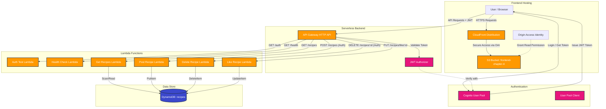

# Architecture

```mermaid
graph TD
    %% User and Clients
    User[User / Browser]

    %% Frontend Section
    subgraph Frontend_Hosting [Frontend Hosting]
        CF[CloudFront Distribution]
        S3[S3 Bucket: frontend-chapter-4]
        OAI[Origin Access Identity]

        User -->|HTTPS Requests| CF
        CF -->|Secure Access via OAI| S3
        OAI -.->|Grant Read Permission| S3
    end

    %% Authentication Section
    subgraph Auth_Service [Authentication]
        Cognito[Cognito User Pool]
        CognitoClient[User Pool Client]

        User -->|Login / Get Token| Cognito
        Cognito -->|Issue JWT Token| User
    end

    %% Backend API Section
    subgraph Backend_API [Serverless Backend]
        APIGW[API Gateway HTTP API]
        Authorizer[JWT Authorizer]

        User -->|API Requests + JWT| APIGW
        APIGW -->|Validate Token| Authorizer
        Authorizer -.->|Verify with| Cognito
    end

    %% Lambda Functions Layer
    subgraph Compute_Layer [Lambda Functions]
        L_Auth[Auth Test Lambda]
        L_Health[Health Check Lambda]
        L_Get[Get Recipes Lambda]
        L_Post[Post Recipe Lambda]
        L_Delete[Delete Recipe Lambda]
        L_Like[Like Recipe Lambda]
    end

    %% Data Layer
    subgraph Data_Layer [Data Store]
        DDB[(DynamoDB: recipes)]
    end

    %% Routes and Integrations
    APIGW -->|GET /auth| L_Auth
    APIGW -->|GET /health| L_Health
    APIGW -->|GET /recipes| L_Get
    APIGW -->|"POST /recipes (Auth)"| L_Post
    APIGW -->|"DELETE /recipes/:id (Auth)"| L_Delete
    APIGW -->|PUT /recipes/like/:id| L_Like

    %% Database Interactions
    L_Get -->|Scan/Read| DDB
    L_Post -->|PutItem| DDB
    L_Delete -->|DeleteItem| DDB
    L_Like -->|UpdateItem| DDB

    %% Styling
    classDef aws fill:#FF9900,stroke:#232F3E,stroke-width:2px,color:white;
    classDef db fill:#3B48CC,stroke:#232F3E,stroke-width:2px,color:white;
    classDef security fill:#E7157B,stroke:#232F3E,stroke-width:2px,color:white;

    class CF,S3,APIGW,L_Auth,L_Health,L_Get,L_Post,L_Delete,L_Like aws;
    class DDB db;
    class Cognito,CognitoClient,Authorizer security;

```
